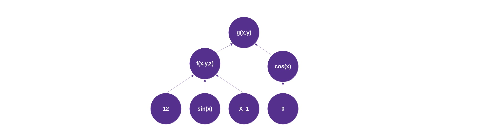
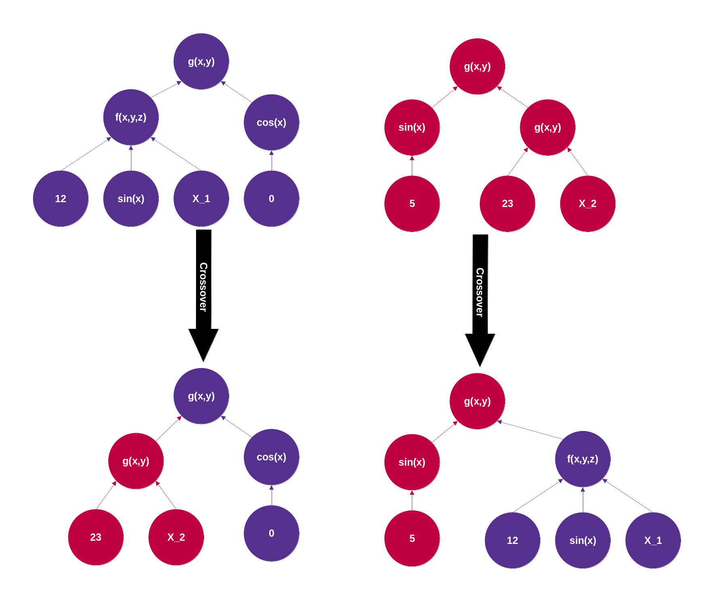
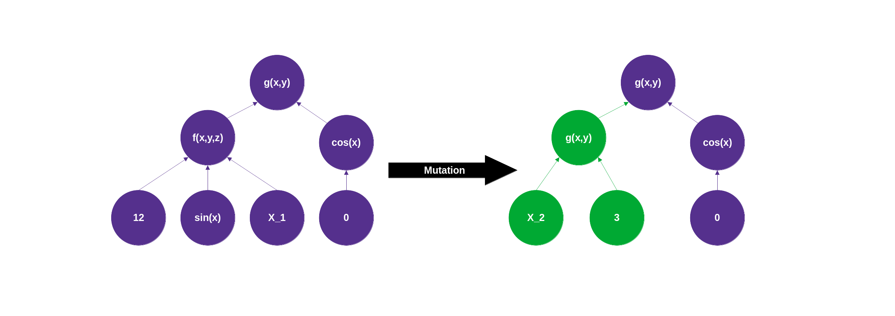

# evolving-forests
A simple side project that allows the exploration of a search space using genetically evolved forests of function trees whose fitness values are evaluated based on Numpy arrays.

Each tree consists of tree nodes corresponding to functions and leaf nodes corresponding to constants or variables (column indices of Numpy arrays). For the tree nodes, any function that maps k values to 1 output value can be used. For example, if a function is of type 5, then it has 5 subtrees, each corresponding to one of its inputs. Consider the following image as an example:

The fitness of trees in a forest is evaluated based on a scoring function that is passed as an argument when trees are developed. Any function can be used, but it must be non-negative with better solutions having higher scores, map to 1 output value for each tree, and accept numpy arrays of type 'O'.

The trees used as the basis for the new generation/forest are selected proportionally to their contribution to the overall fitness of the forest. Crossover is implemented by swapping random subtrees, as shown in the figure below:

Similar to the crossover method, mutation replaces a random subtree with a randomly generated tree:

# Things to consider
- Because trees are randomly generated, there is no guarantee that the outputs of the subtrees will be valid inputs for the nodes above them. For example, if cos() and sqrt() are allowed, it could happen that sqrt(cos(3)) should be calculated during evaluation
- Due to the expected nature of trees, random selection of subtrees will favor those that are in the lower layers. Therefore, it is expected that the outermost functions will not change as much as the inner functions.
- Changing complete subtrees is a fairly aggressive strategy. It might be preferred to replace only nodes of the same arity and leave the rest of the tree unchanged. However, this would require that there be at least some functions of the same arity in the set of functions used for the tree nodes in order to make actual changes.